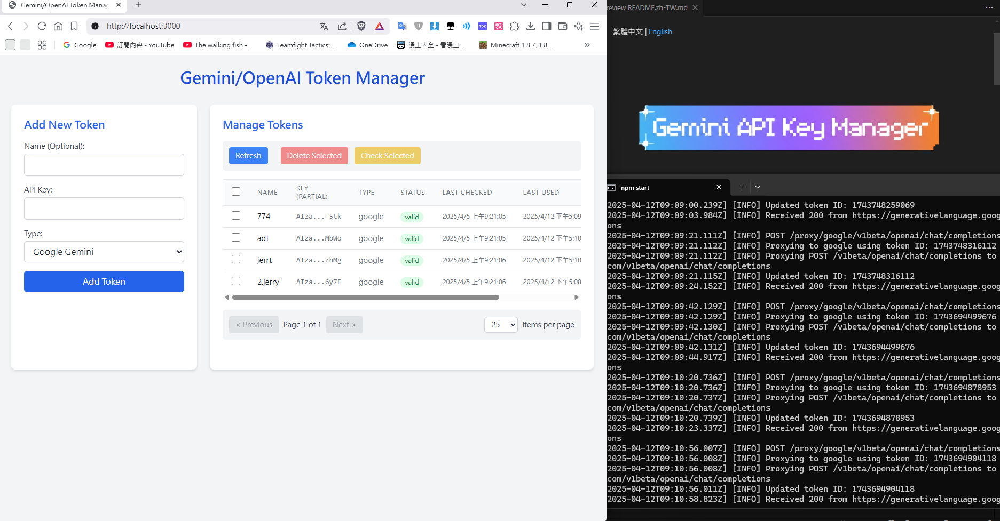

# Gemini API Key Manager

[](https://opensource.org/licenses/MIT)

[繁體中文](README.md) | English


---

### Introduction

Gemini API Key Manager is a Node.js application designed to manage and proxy API keys for Google Gemini and OpenAI services. It provides a RESTful API for key management, load balancing to distribute requests across multiple keys, and a simple web-based admin interface. It also supports proxying standard and streaming (Server-Sent Events) API requests.



### Features

*   **RESTful API:** Manage API keys (CRUD, batch operations, status checks).
*   **Proxy Endpoints:** Proxy requests to Google Gemini (`/proxy/google`) and OpenAI (`/proxy/openai`).
*   **Load Balancing:** Distribute API requests using a Round-Robin strategy across available keys (skips temporarily invalid keys).
*   **Streaming Support:** Handles Server-Sent Events (SSE) streaming responses from AI models.
*   **Admin UI:** A simple web interface (served from `/`) to view, add, delete, and check the status of API keys. Supports batch operations and pagination.
*   **Data Persistence:** Stores key information in a JSON file (default: `data/tokens.json`).
*   **Configuration:** Highly configurable via environment variables (supports `.env` files).
*   **Docker Support:** Comes with a `Dockerfile` and `docker-compose.yml` for easy containerization and deployment.
*   **Logging:** Configurable console logging for API requests, proxy operations, and errors.

### Project Structure

```
gemini-api-key-manager/
├── .env                # Environment variables (optional, copy .env.example)
├── .gitignore
├── Dockerfile
├── docker-compose.yml
├── LICENSE
├── package.json
├── README.md           # This file (English README)
├── README.zh-TW.md     # Traditional Chinese README
├── data/               # Data persistence (stores tokens.json)
├── docs/               # Documentation and examples
│   └── examples.md
├── public/             # Static frontend files for Admin UI
│   ├── index.html
│   └── script.js
├── src/                # Backend source code
│   ├── server.js       # Main Express server setup
│   ├── api.js          # API route handlers
│   ├── proxy.js        # Proxy logic handlers
│   ├── tokenStore.js   # Logic for reading/writing tokens.json
│   ├── config.js       # Configuration loading
│   └── logger.js       # Logging utility
└── tests/              # Test files (optional)
```

### Installation

1.  **Clone the repository:**
    ```bash
    git clone https://github.com/ADT109119/gemini-api-key-manager
    cd gemini-api-key-manager
    ```
2.  **Install dependencies:**
    ```bash
    npm install
    ```
3.  **Create `.env` file (Optional):**
    Copy `.env.example` (if provided) or create a new `.env` file in the root directory to override default configurations. See the [Configuration](#configuration) section.
4.  **Ensure `data` directory exists:**
    The application will attempt to create it, but ensure permissions allow it, or create it manually:
    ```bash
    mkdir data
    ```

### Usage

*   **Start the server:**
    ```bash
    npm start
    ```
    The server will typically run on `http://localhost:3000` (or the port specified in your configuration).

*   **Access the Admin UI:**
    Open your web browser and navigate to `http://localhost:3000/`.

*   **Use the API Endpoints:**
    Interact with the API endpoints using tools like `curl` or Postman. Refer to [API Endpoints](#api-endpoints) and `docs/examples.md`.

### Configuration

Configure the application using environment variables or an `.env` file in the project root.

*   `PORT`: The port the server listens on (default: `3000`).
*   `DATA_PATH`: Path to the JSON file for storing token data (default: `data/tokens.json`).
*   `LOG_LEVEL`: Logging level (e.g., `info`, `debug`, `warn`, `error`) (default: `info`).
*   `GOOGLE_API_ENDPOINT`: Base URL for the Google Gemini API.
*   `OPENAI_API_ENDPOINT`: Base URL for the OpenAI API.

### API Endpoints

*   **Admin UI:** `GET /` - Serves the web interface.
*   **Key Management:** `GET, POST, DELETE /api/keys` - CRUD operations for API keys. Supports batch add/delete.
    *   `GET /api/keys/status` - Check the status of all keys.
    *   `POST /api/keys/check` - Check the status of specific keys.
*   **Proxy:**
    *   `POST /proxy/google/v1beta/openai/chat/completions` - Proxies requests to the Google Gemini API.
    *   `POST /proxy/openai/v1/chat/completions` - Proxies requests to the OpenAI API.

*(Refer to `docs/examples.md` for detailed API usage examples.)*

### Admin UI

The web-based admin interface allows for easy management of API keys:

*   View all registered keys and their status.
*   Add keys individually or in batches.
*   Delete keys individually or in batches.
*   Manually trigger status checks for keys.
*   Basic pagination for large numbers of keys.

### Docker

Build and run the application using Docker:

1.  **Build the image:**
    ```bash
    docker build -t gemini-api-key-manager .
    ```
2.  **Run the container:**
    ```bash
    # Example command, adjust volume paths and .env file as needed
    docker run -p 3000:3000 -v $(pwd)/data:/app/data --env-file .env -d --name gemini-api-key-manager gemini-api-key-manager
    ```
    *   `-p 3000:3000`: Maps host port 3000 to container port 3000.
    *   `-v $(pwd)/data:/app/data`: Mounts the local `data` directory into the container for persistence. Adjust `$(pwd)/data` if your data directory is elsewhere.
    *   `--env-file .env`: (Optional) Loads environment variables from your `.env` file.
    *   `-d`: Runs the container in detached mode.
    *   `--name key-manager`: Assigns a name to the container.

Alternatively, use Docker Compose:

1.  **Start the services:**
    ```bash
    # Ensure service names in docker-compose.yml are updated if necessary
    docker-compose up -d
    ```
2.  **Stop the services:**
    ```bash
    docker-compose down
    ```
    *(Ensure `docker-compose.yml` is configured correctly, especially volume paths and service names.)*

### Using the Pre-built Docker Image

You can also quickly start the application using the pre-built image available on Docker Hub.

[](https://hub.docker.com/r/adt109119/gemini-api-key-manager)

```bash
# Pull the latest image
docker pull adt109119/gemini-api-key-manager:latest

# Run the container (similar to the self-built example, but using the pre-built image name)
docker run -p 3000:3000 -v $(pwd)/data:/app/data --env-file .env -d --name gemini-api-key-manager adt109119/gemini-api-key-manager:latest
```
*   Make sure to adjust the volume mount path (`$(pwd)/data`) and the `.env` file path according to your environment.

## Contributing

Contributions are welcome! Please feel free to submit Pull Requests or open Issues. (Add specific contribution guidelines if desired).

## License

This project is licensed under the MIT License - see the [LICENSE](LICENSE) file for details.
